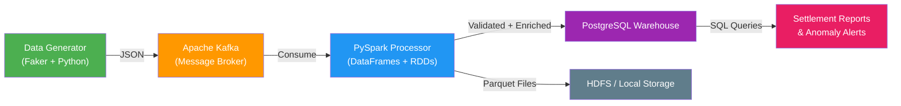

# Real-Time Financial Transaction Pipeline

So, I built this end-to-end data pipeline that takes streaming financial transactions, pushes them through Kafka, processes everything with PySpark, and loads the clean data into a PostgreSQL warehouse. The whole thing handles 500K+ simulated records, catches anomalies automatically, and generates daily settlement reports. I wanted to build something that actually shows how real-time data pipelines work from start to finish, not just a toy example.

## How It Works



## Tech Stack

| Tool | Why I Used It |
|------|--------------|
| **Python** | Main language for everything — data generation, orchestration, and testing |
| **Apache Kafka** | I needed a message broker so that the pipeline can take in transactions as they arrive in real time |
| **PySpark** | For distributed processing — I used both DataFrames and RDD operations so that I can handle transforms and anomaly detection at scale |
| **Hadoop (HDFS)** | Scalable storage for intermediate parquet files |
| **PostgreSQL** | Relational warehouse so that I can run complex JOINs and window functions for analytics |
| **Docker** | Containers for Kafka, Zookeeper, and PostgreSQL so that everything runs locally with one command |

## Project Structure

```
financial-data-pipeline/
├── README.md
├── docker-compose.yml
├── requirements.txt
├── .gitignore
├── .env.example
├── data_generator/
│   ├── __init__.py
│   └── transaction_generator.py    # Generates 500K+ realistic transactions
├── kafka_producer/
│   ├── __init__.py
│   └── producer.py                 # Sends records to Kafka with retry logic
├── spark_processor/
│   ├── __init__.py
│   ├── batch_processor.py          # Core PySpark engine (DataFrames + RDDs)
│   └── data_validator.py           # Validates records before processing
├── warehouse/
│   ├── __init__.py
│   ├── schema.sql                  # PostgreSQL warehouse schema (5 tables)
│   └── loader.py                   # Bulk loader with ON CONFLICT dedup
├── analytics/
│   ├── __init__.py
│   └── settlement_reports.sql      # 5 analytical queries (JOINs, CTEs, window functions)
├── pipeline/
│   ├── __init__.py
│   └── orchestrator.py             # End-to-end runner with --mode and --skip-kafka
├── tests/
│   ├── __init__.py
│   ├── test_generator.py
│   ├── test_validator.py
│   └── test_pipeline.py
└── config/
    └── pipeline_config.yaml
```

## What You Need Before Starting

To get this working, we need to do three things here: having Docker installed for Kafka, Zookeeper, and PostgreSQL containers, having Python 3.9+ on your machine, and then making sure Java 8+ is available because PySpark needs it.

## Quick Start

```bash
# Clone the repo
git clone https://github.com/Ch-Suharsha/financial-data-pipeline.git
cd financial-data-pipeline

# Start the infrastructure
docker-compose up -d

# Install Python dependencies
pip install -r requirements.txt

# Run the pipeline in test mode (100 records)
python -m pipeline.orchestrator --mode test

# Run the full pipeline (500K records)
python -m pipeline.orchestrator --mode full

# Run without Kafka (in-memory processing)
python -m pipeline.orchestrator --mode test --skip-kafka
```

## Pipeline Stages

### Data Generation

I used the Faker library to generate realistic financial transactions. Each record has a transaction ID, account, amount, type (like WAGER_PLACEMENT, REFUND, DEPOSIT, etc.), merchant, location, and status. I also added anomaly injection so that about 2% of the records are intentionally suspicious — things like unusually high amounts, odd-hour transactions, and rapid successive transactions from the same account.

### Kafka Ingestion

The next thing would be sending the generated transactions to a Kafka topic. I set up JSON serialization and added retry logic (up to 3 retries) so that the producer doesn't just crash on the first error. It also handles automatic topic creation and logs throughput metrics so you can see how fast records are flowing.

### Spark Processing

This is the core part. The Spark engine reads data from Kafka (or in-memory if you're developing locally), and then does a bunch of things: first it validates each record against business rules like UUID format, amount bounds, and timestamp checks. Then it transforms the data using the DataFrame API — adds derived columns like `transaction_date`, `amount_bucket`, and `is_suspicious`. I also used RDD `map()` to compute a risk score (0 to 1) based on transaction characteristics so that both DataFrame and RDD operations are clearly demonstrated. Finally, it uses window functions (`SUM OVER`, `LAG`) for daily settlement aggregation and anomaly detection.

### Warehouse Loading

Now, the validated and enriched data gets bulk-loaded into PostgreSQL using `psycopg2`. I used `execute_values` for performance and `ON CONFLICT DO NOTHING` so that duplicate records don't break anything. Every batch also gets its data quality metrics logged so you can track how clean your data is over time.

### SQL Analytics

I wrote 5 analytical queries that show different SQL techniques: daily settlement summaries with running totals using `SUM OVER` and `LAG`, top accounts by volume with anomaly alert JOINs, hourly transaction distribution using CTEs, merchant risk ranking with `RANK` and `DENSE_RANK`, and account behavior pattern detection using `LAG`, `LEAD`, and `ROW_NUMBER`.

## SQL Examples

### Daily Settlement with Running Totals

```sql
SELECT
    settlement_date,
    transaction_type,
    total_amount,
    SUM(total_amount) OVER (
        PARTITION BY transaction_type
        ORDER BY settlement_date
    ) AS running_total,
    total_amount - LAG(total_amount, 1) OVER (
        PARTITION BY transaction_type
        ORDER BY settlement_date
    ) AS day_over_day_change
FROM daily_settlements
ORDER BY settlement_date DESC;
```

### Top 10 Accounts with Alert Correlation

```sql
SELECT
    pt.account_id,
    COUNT(*) AS total_transactions,
    SUM(pt.amount) AS total_volume,
    COALESCE(aa.alert_count, 0) AS alerts
FROM processed_transactions pt
LEFT JOIN (
    SELECT account_id, COUNT(*) AS alert_count
    FROM anomaly_alerts
    GROUP BY account_id
) aa ON pt.account_id = aa.account_id
GROUP BY pt.account_id, aa.alert_count
ORDER BY total_volume DESC
LIMIT 10;
```

## Data Quality

The pipeline validates every record before processing so that bad data doesn't reach the warehouse. Here are the rules:

| Rule | What It Checks |
|------|----------------|
| Transaction ID | Non-null, valid UUID format |
| Amount | Positive, under 100,000 |
| Account ID | Matches `ACC_XXXXX` pattern |
| Timestamp | Valid ISO format, not in the future |
| Transaction Type | One of 6 valid types |
| Currency | Valid 3-letter code |

Invalid records get logged with their specific errors. Quality metrics like total, valid, invalid, and error breakdown are stored in the `data_quality_log` table for every single batch.

## Sample Output

```
======================================================================
Financial Transaction Pipeline — Run a1b2c3d4
  Mode:        test
  Skip Kafka:  True
  Started at:  2026-02-23T09:00:00
======================================================================
[Step 1/10] Config loaded. Records: 100, Batch: 100
[Step 2/10] Infrastructure check complete.
[Step 3/10] Generated 100 records.
[Step 4/10] Skipped (--skip-kafka).
[Step 5/10] Validation: 100/100 valid (100.0%)
[Step 6/10] Spark processing done — 100 transformed, 3 anomalies.
[Step 7/10] PostgreSQL loaded — raw: 100, processed: 100, settlements: 42, anomalies: 3
======================================================================
PIPELINE SUMMARY
======================================================================
  Run ID:                  a1b2c3d4
  Mode:                    test
  Total time:              4.23s
  Records generated:       100
  Records valid:           100
  Records invalid:         0
  Records transformed:     100
  Settlement rows:         42
  Anomalies detected:      3
  Loaded to PostgreSQL:    Yes
  Kafka used:              No
======================================================================
```

## Running Tests

```bash
python -m pytest tests/ -v
```

The tests cover the data generator (batch sizes, required fields, anomaly rates, amount bounds), the data validator (valid and invalid record handling, all validation rules, batch reports), and pipeline integration (end-to-end flow, Spark DataFrame creation, transformation verification, and anomaly detection output).

And that's it! Feel free to reach out if you have any suggestions or questions.
